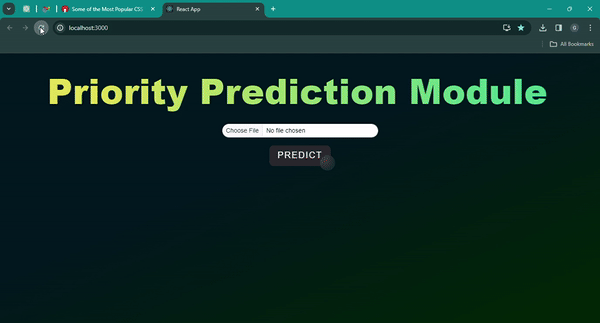

# ML Model for Automation Testing

**DO NOT USE WITHOUT PERMISSION**

  

## Overview

This project, named "ML Model for Automation Testing," aims to streamline the testing process through the implementation of machine learning techniques. The project leverages a Logistic Regression model, trained on manual test cases, to predict the priority score of new test cases. The entire solution is encapsulated within a user-friendly React application. Flask serves as the backend, managing ML predictions and handling HTTPS requests via Axios.

## Motivation

Traditional manual testing can be time-consuming and often lacks efficiency. This ML automation project seeks to enhance testing procedures by automating the prioritization of test cases, reducing manual effort, and increasing overall testing efficiency.

## Key Features

- **Machine Learning Integration**: Trains a Logistic Regression model on historical manual test cases to predict the priority score of new test cases.
  
- **React Frontend**: User-friendly interface for interacting with the ML predictions.

- **Flask Backend**: Manages machine learning predictions and serves the React frontend.

- **Axios for HTTPS Requests**: Utilizes Axios for secure communication between the frontend and backend.

## Model Training

The machine learning model is trained on a dataset consisting of manual test cases. The model generalizes from this data to predict the priority of new test cases based on their features.

### Model Accuracy

The current model achieves an accuracy of 55%, demonstrating its effectiveness in prioritizing test cases.

## Project Structure

The project is structured as follows:

- `backend/`: Flask backend handling ML predictions and serving the React frontend.
  
- `frontend/`: React app for user interaction and displaying ML predictions.

- `models/`: Contains the trained machine learning model and related files.

## Getting Started

**WILL BE UPDATED SOON (UNDER DEVELOPMENT)**

## Contributions

Contributions to the project are welcome. If you intend to use or contribute to this project, please reach out for permission.

## License

This project is not licensed for public use. Unauthorized use is strictly prohibited.
